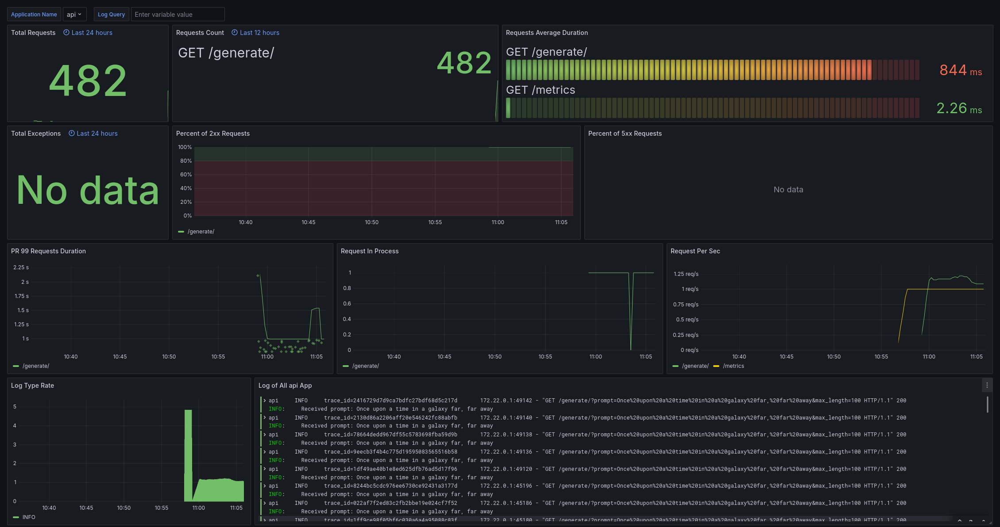
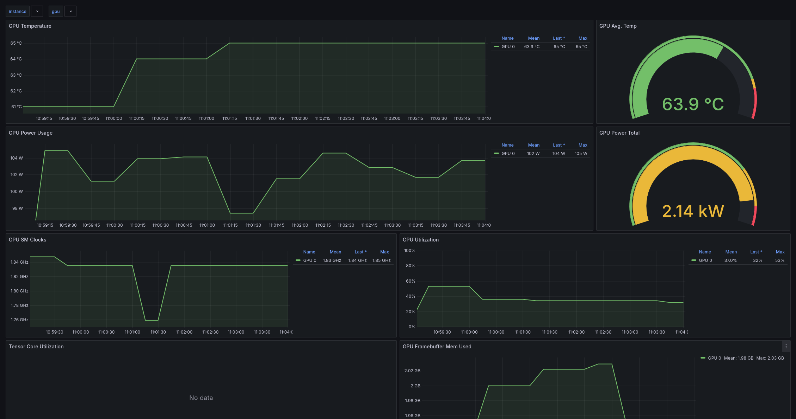

One Click Deploy
================





### Instant AI Setup & Deployment

This repository delivers an all-in-one, container-based workflow for running AI models, packed with a top-notch developer environment right out of the gate. With just a few commands, you’ll pull down a model, spin up an API, run tests, apply code-quality checks, and deploy into production—complete with observability, metrics, logs, and email alerts.

* * *

Features
--------

1. **Local Model Caching**  
    Automatically fetch and store AI models from Hugging Face, making future runs lightning fast.

2. **API Serving**  
    A FastAPI application that cleanly exposes the downloaded models to any client.

3. **Docker Dev-Mode with Debugpy**  
    Container-based remote debugging so you can attach a Python debugger while the app runs inside Docker.

4. **Comprehensive Testing**  
    Both GPU-accelerated tests and CPU-based tests (useful for CI environments without GPU access).

5. **Pre-Commit Hooks**  
    Enforce code-quality standards inside Docker each time you commit. Optionally, run hooks on every file with a single command.

6. **GitHub Actions CI**  
    Automatic testing plus additional steps to maintain code quality and reliability.

7. **Full Observability**

    * **Prometheus** for metrics
    * **Tempo** for distributed tracing
    * **Loki** for logs
    * **DCGM** for GPU monitoring
    * **Grafana** for a cohesive visualization layer
8. **Continuous Deployment**  
    GitHub Actions + a `post-receive` hook let you push updates to a remote server and rebuild your containers automatically.

9. **Production Alerts**  
    Email notifications when things go sideways, so you can fix issues before they escalate.

All of this is orchestrated through Docker for consistent environments across development, testing, and production.

* * *

Why It Matters
--------------

In large-scale AI projects, piecing together dependencies, model downloads, debugging tools, and monitoring systems can spiral into a maintenance nightmare. This repository is intended to shortcut that entire process. Five years from now, you should still be able to clone this project, run a single command, and continue building without messing around with conflicting Python environments or missing libraries.

* * *

Quickstart Commands
-------------------

Here’s a high-level overview of the most important `make` commands:

* **`make setup`**

  * Caches a local copy of GPT-2 from Hugging Face (or any other configured model). Must be run at least once before launching or testing the app.
* **`make run`** / **`make run-debug`**

  * Starts the application in Docker. `run-debug` exposes a debug port (`debugpy`) for remote Python debugging.
* **`make test`** / **`make test-debug`**

  * Executes all tests, optionally with debugging support.
  * **`make test-cicd`**: Same as `make test` but excludes GPU usage for CI runners without GPUs.
* **`make clean`**

  * Removes dangling Docker images you no longer need.
* **`make precommit`** / **`make precommit-all`**

  * Triggers pre-commit checks on staged or on all repository files.
* **`make request`**

  * Sends a quick test request to your local FastAPI endpoint.

* * *

Initial Setup
-------------

Despite the “all-inclusive” approach, you’ll need a few prerequisites to get the most out of this repository:

1. **Docker**

    * [Install Docker](https://docs.docker.com/engine/install/) on your system.
2. **Loki Docker Plugin**

    ```bash
    docker plugin install grafana/loki-docker-driver:latest --alias loki --grant-all-permissions
    ```

    * Required so that Docker logs are shipped to Loki.
3. **GPU Support (Optional)**

    * If you have an NVIDIA GPU and want hardware acceleration, install [NVIDIA’s CUDA toolkit](https://docs.nvidia.com/datacenter/cloud-native/container-toolkit/latest/install-guide.html).
4. **Make Utility**

    * On many Linux systems:

        ```bash
        sudo apt-get install make
        ```

* * *

Setting Up Pre-Commit Hooks
---------------------------

You can run pre-commit checks automatically before each commit by adding this script to `.git/hooks/pre-commit`:

```bash
#!/bin/sh

make precommit
if [ $? -ne 0 ]; then
  echo "Pre-commit hook failed. Aborting commit."
  exit 1
fi

exit 0
```

Give it execute permission:

```bash
chmod +x .git/hooks/pre-commit
```

Now, every commit attempt will trigger a Docker-based pre-commit check, ensuring your code meets the quality bar.

* * *

Production Alerting
-------------------

When running in a production environment, Grafana can email you about critical issues. If you prefer Gmail:

1. Log in at [myaccount.google.com](https://myaccount.google.com/) and open the **Security** tab.
2. Enable **2-Step Verification** if you haven’t already.
3. Under **App Passwords**, create a new one labeled (for example) "Grafana Alerts."
4. Copy that app-specific password and use it in place of your standard Gmail password in Grafana.

Then add this to `./etc/grafana/grafana.ini`:

```ini
[smtp]
enabled = true
host = smtp.gmail.com:587
user = you@gmail.com
password = """app password"""
skip_verify = true
from_address = you@gmail.com
from_name = Grafana Alerts
```

You can test your alerts by navigating to `http://127.0.0.1:3000/alerting/notifications/receivers/new`, entering your email under “Addresses,” and selecting “Test.”

* * *

Continuous Deployment (CD)
--------------------------

If you’d like your updates to automatically roll out to a server with a GPU (or any other environment), follow these steps:

1. **Server Setup**

    * Confirm your remote machine has Docker, Loki plugin, CUDA (if GPU-based), and Make installed.
    * On that server, create `/root/api/` and `/root/api/.git/`.
    * Inside `/root/api/.git/`, initialize a bare Git repo:

        ```bash
        git init --bare
        git config receive.denyCurrentBranch updateInstead
        ```

    * In `/root/api/.git/hooks/`, create `post-receive`:

        ```bash
        git --work-tree=/root/api --git-dir=/root/api/.git checkout -f
        cd /root/api
        docker compose down
        docker compose up --build api tempo grafana --remove-orphans -d
        ```

    * Give it execute permission:

        ```bash
        chmod +x /root/api/.git/hooks/post-receive
        ```

2. **SSH Key Generation (Local Machine)**

    ```bash
    ssh-keygen -t rsa -b 4096 -C "your_email@example.com"
    ```

    Copy the public key into your server’s `~/.ssh/authorized_keys` and run:

    ```bash
    chmod 600 ~/.ssh/authorized_keys
    ```

3. **GitHub Actions Configuration**

    * In `.github/workflows/tests.yaml`, you’ll find a sample “deploy” job to uncomment or modify:

        ```yaml
        deploy:
          needs: test
          runs-on: ubuntu-latest
          steps:
            - name: Checkout repository
              uses: actions/checkout@v2
              with:
                fetch-depth: 0
        
            - name: Deploy to server
              env:
                SSH_PRIVATE_KEY: ${{ secrets.SERVER_SSH_PRIVATE_KEY }}
              run: |
                mkdir -p ~/.ssh
                echo "$SSH_PRIVATE_KEY" > ~/.ssh/id_rsa
                chmod 600 ~/.ssh/id_rsa
                ssh-keyscan -H yourserver.com >> ~/.ssh/known_hosts
                git remote add deploy ssh://root@yourserver.com/root/api
                git push deploy master
        ```

    * Next, go to your GitHub repo’s **Settings → Secrets → Actions** and add your private key as a secret named `SERVER_SSH_PRIVATE_KEY`.

If you prefer a manual approach, you can add the remote directly to your local repo:

```bash
git remote add deploy ssh://root@yourserver.com/root/api
```

But be aware that bypasses the automated testing in CI.

* * *

Debugging Inside Docker
-----------------------

If you’d like to attach a debugger (for instance, from Neovim or VS Code) to your Python processes in Docker:

1. **Debugger Adapter**

    ```lua
    dap.adapters.python = {
      type = 'server',
      host = 'localhost',
      port = 5678,  -- matches debugpy port in Docker
    }
    ```

2. **Debug Configuration**

    ```lua
    dap.configurations.python = {
      {
        type = 'python',
        request = 'attach',
        name = 'Dockerfile - /workspace',
        pathMappings = {
          {
            localRoot = vim.fn.getcwd(),      -- local project directory
            remoteRoot = '/workspace',       -- container’s working directory
          },
        },
      },
    }
    ```

After starting your container with `make run-debug`, connect your editor’s debug adapter to `localhost:5678`.

* * *

Wrap-Up
-------

This repository aims to streamline and de-stress every phase of AI project development—model retrieval, environment setup, testing, logging, metrics, debugging, and automated deployment. It’s all here and runs consistently thanks to Docker. Fork or clone this repo, customize it to your heart’s content, and go build something amazing. If you improve it, feel free to submit a PR!
